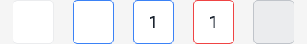

# Pin Code — staging test report

**Run:** first pass (no prior rows existed)
**Date:** 02/10/2026
**Component row:** `recRl3u6J8uVXq1Tv` · Category ATOMS · `Development` was `Ready for Testing` (gate 7)
**Figma:** node `260:6558`, file `EupMGlgXy06FSwOr2WLZWF` — component set "Pin Code Cell"
**Staging Storybook:** `https://horizon-design-system-git-component-pin-code-htar1.vercel.app`
— re-read live from the `Staging Storybook` cell at the start of this pass, not carried in.
PR #21 into `staging`, open and unmerged by design; its preview is what was tested.
**Commit cell:** `c574347`

---

## Preconditions checked before any measurement

**Staging link present.** The cell was non-empty, so the pass proceeded. Nothing was
tested locally and nothing was read off the story file to build the matrix.

**Fonts genuinely loaded — measured, not flagged.** A canvas probe measured the same
string at 22px in the declared family and again in a deliberately bogus family:

| Family | Declared | Bogus family | Distinct? |
|---|---|---|---|
| Roboto | 312.73px | 293.90px | yes — genuinely loaded |

`document.fonts.check('22px Roboto')` returned `true`, and was **not** relied on. Only
`Roboto 400 normal` is actually loaded; every other declared face reports `unloaded`,
which is fine because the node binds `weight/regular` only.

**Mode named on both sides.** `build/css/tokens.css` contains a single `:root` block and
no dark block, `@media (prefers-color-scheme)` rule or `[data-theme]` selector — the
rendered side can only be Light. `get_variable_defs` answered with values identical to
that block (`#ffffff`, `#ebecee`, `#3b82f6`, `#ef4444`, `#c0c4ca`, `#1c242f`), so the
design side was answering in Light too. Both sides Light; no colour comparison here is
cross-mode.

---

## The matrix, read from Figma

`get_metadata` on `260:6558` returns **one axis — `State` — with five values**, and no
size axis. Every variant frame is 52 × 56.

| # | Variant node | State | Size axis |
|---|---|---|---|
| 1 | `260:6559` | Default | none |
| 2 | `260:6561` | Hovered | none |
| 3 | `260:6563` | Typed | none |
| 4 | `260:6565` | Error | none |
| 5 | `260:6567` | Disabled | none |

`get_variable_defs` was run **per variant node**, not only on the set — the set-level call
returns the union of all five and would have implied bindings no single variant carries:

| Node | Bindings on that node alone |
|---|---|
| `260:6559` Default | `color/bg/base` · `color/border/surfacePrimary` |
| `260:6561` Hovered | `color/bg/base` · `color/border/brand/bold` |
| `260:6563` Typed | `color/bg/base` · `color/border/brand/bold` · `color/text/primary` · `Title/Large` |
| `260:6565` Error | `color/bg/base` · `color/border/negative/bold` · `color/text/primary` · `Title/Large` |
| `260:6567` Disabled | `color/bg/surfacePrimary` · `color/border/disabled` |

Story reconciliation: the story file covers exactly these five, plus two composite
stories (`AllVariants`, `Interactive`) that render no new case. **No missing case, no
orphan story.**

---

## Results — one row per case

| # | Variant | Size | State | Verdict |
|---|---|---|---|---|
| 1 | State=Default | null | idle | **Passed** |
| 2 | State=Hovered | null | hovered | **Passed** |
| 3 | State=Typed | null | filled | **Passed** |
| 4 | State=Error | null | error, filled | **Passed** |
| 5 | State=Disabled | null | disabled | **Passed** |

5 of 5 passed. All five rows written to `stagingTesting` and linked to the component via
`Composed In`.

### 1 · State=Default — Passed
`components-pin-code--default` · node `260:6559` · 
Fill `--color-bg-base`, stroke `--color-border-surfaceprimary`. Measured 52 × 56, radius
6px, `box-sizing: border-box` so the inside-aligned stroke adds nothing to the frame.
Empty at rest, as the node shows.

### 2 · State=Hovered — Passed
`components-pin-code--hovered` · node `260:6561` · 
Stroke `--color-border-brand-bold`, fill `--color-bg-base`. **Driven, not just rendered:**
a real pointer hover on the Default story produced the identical stroke value and the
element genuinely matched `:hover`. A first hover attempt at mis-mapped coordinates did
*not* match `:hover`; it was re-driven at the corrected point rather than reported as a
result.

### 3 · State=Typed — Passed
`components-pin-code--typed` · node `260:6563` · 
Stroke `--color-border-brand-bold`, fill `--color-bg-base`, digit `--color-text-primary`,
type Roboto 400 22px/28px — the node's `Title/Large` composite. **Driven:** clicking the
Default cell and typing a real character set `data-filled="true"` and swapped the stroke
to brand/bold, so Typed is keyed on the genuine filled state, not a static class.

`letter-spacing` computes as `normal`. This is **not** a missing binding — Chrome
normalises a `0px` value to `normal`. Probed directly on a throwaway element: `3px`
reports `3px`, `0px` reports `normal`. `--tracking-title-large` (0px) is applied.

### 4 · State=Error — Passed
`components-pin-code--error-state` · node `260:6565` · 
Stroke `--color-border-negative-bold`, fill `--color-bg-base`, digit still visible on
`--color-text-primary`. Worth stating explicitly: the node binds the digit to
`color/text/primary` on Error — **only the stroke moves to negative** — so the component
is correct *not* to recolour the digit. The negative stroke is keyed on
`aria-invalid="true"`, so the painted state and the announced state cannot drift apart.

### 5 · State=Disabled — Passed
`components-pin-code--disabled` · node `260:6567` · 
Fill `--color-bg-surfaceprimary`, stroke `--color-border-disabled`, opacity 1, cursor
`not-allowed`. **Driven, not inferred — genuinely inert:** the `disabled` attribute is
present, a programmatic `focus()` left `activeElement` on `BODY`, a real click fired the
click handler **zero** times, a dispatched keydown produced **zero** input events and left
the value empty, and neither fill nor stroke moved to brand under hover — Disabled
correctly wins over Hovered. The node's own accessibility note asks for exactly this
("Disabled is visual only. Disable the control in code too"), and the build satisfies it.

Figma reference render for all five: 

---

## Excluded as renderer artefacts, not logged as defects

**The 0.8px border.** Every state computes `border-top-width: 0.8px` against a declared
`1px`. `devicePixelRatio` is 1.25 and 0.8 × 1.25 = exactly **1 device pixel** — the
browser snapping a 1px border to the device grid. The declared value is `1px` and the
specified custom property reads `1px`. A consistent delta across *every* case, which
points at the renderer, not the component. Not a finding.

---

## Design gaps — the designer's, not the engineer's

None of these are logged against the engineer. Each is a property the design leaves
unbound, or a contradiction inside the Figma node itself.

**G1 · Corner radius 6 has no token anywhere in the build.** The node carries no radius
variable, and no token matches: `--borderradius-extra-small` is 4px and
`--borderradius-small` is 8px. The node's own SPEC prose concedes it. This is a genuine
hole in the token set, not just an unbound property — the value cannot be bound until a
token exists.

**G2 · Stroke weight 1 is unbound, though a matching token exists.** `--borderwidth-1` is
exactly 1px and is even described "Default outline", but no variant node binds it. One
Figma binding would close this with no code change beyond a single line.

**G3 · Cell width 52 and height 56 are unbound.** No token is 52px (`--spacing-48` and
`--spacing-56` straddle it), so width has the same shape of hole as G1. Height 56 is
different: `--spacing-56` exists and is exactly 56px but the design does not point at it.

**G4 · No focus variant exists in the set.** The node's own accessibility note concedes
it: "Hover is not a substitute for focus. Keyboard focus needs its own treatment — not
yet in this set." The component leaves the native focus ring intact rather than inventing
a ring or resetting it away, which keeps the cell keyboard-usable until the design
supplies the variant. Correct handling of a gap; a focus case cannot be tested against a
design that does not define one.

**G5 · The node's SPEC prose contradicts its own bindings in three places.** The bindings
win, and the component followed the bindings every time. The prose needs correcting so a
later reader does not "fix" the component to match stale text:

| SPEC prose says | The variant node actually binds |
|---|---|
| "The resting stroke stays #d7dee7. That grey has no matching token." | `260:6559` binds `color/border/surfacePrimary` — a real, exported, resolving token |
| "The digit is Inter Semi Bold 22 in #1b2733. That size and colour have no matching token." | `260:6563`/`260:6565` bind `Title/Large` (Roboto **Regular** 22/28) and `color/text/primary` |
| "Value … defaults to 4" | the set's own default `Value` resolves to **1** (`get_design_context` and the node render) |

Only the fourth prose claim — "Radius 6 has no token. borderradius/small is 8" — is
accurate, and it is G1.

---

## Token check

No raw hex, px or font value appears in `pinCode.js` or `pinCode.css` outside the four
`--hz-pincode-*-unbound` custom properties, which park exactly the four properties Figma
leaves unbound (G1–G3) and substitute no near-fitting token for them. That is the correct
treatment: the gap stays visible instead of being papered over with a token the design
never chose.

---

## Not done, and why

**`Attachment` is empty on all five rows.** The Airtable connector exposes no attachment
upload; the field takes a publicly reachable URL, and these screenshots are local files.
No prior row in `stagingTesting` carries an attachment either, so this run follows the
established state of the base rather than inventing a host for the images. The
screenshots exist in `reports/PinCode/` and are referenced above. Populating the field
needs either an upload path or a public URL — a human decides which.

---

## Registry effect

Five `Passed` rows, no `Failed`, so `Staging Testing Results Summary` is non-empty and
contains no `Failed` and no `re-test`. Gates 1, 2 and 3 do not match; gate 4 is
unreachable (reviewer deferred); gate 5 needs `Production Storybook`, which is unset.
**Gate 6 matches: `Development` moves to `To be deployed`.** Nothing was written on the
component row itself — `[Staging] Test Records` populated as a side effect of the
`Composed In` links.
